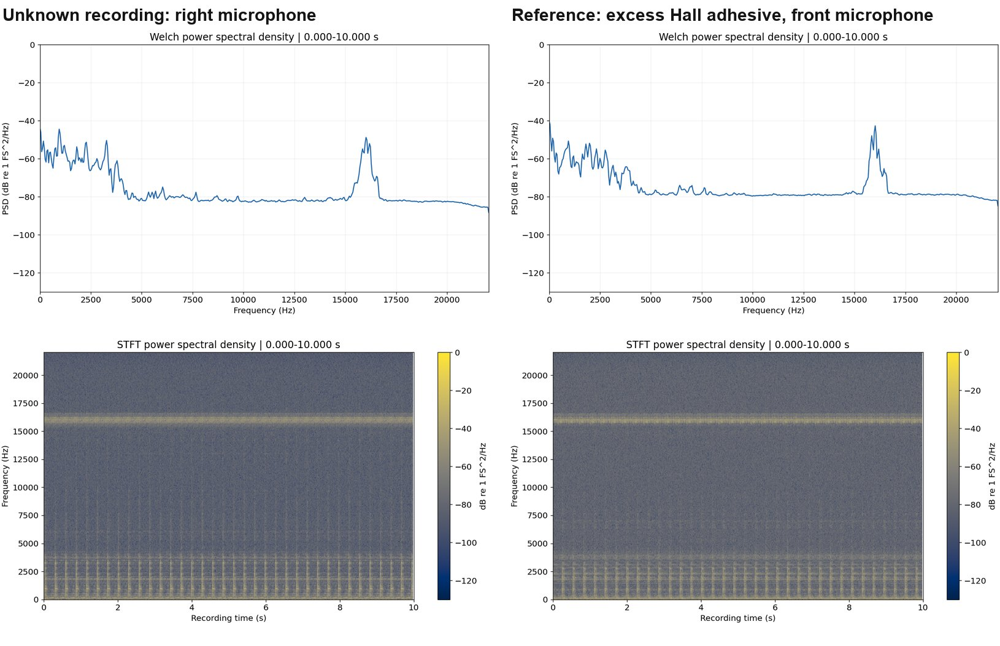

# ModelMetis

**ModelMetis recognizes machine conditions from audio: it turns each recording into signal-processing diagrams and measurements, and a general multimodal model compares them with recordings of known conditions.** With reports plus spectral distances it recognized 11 of 12 reserved Jin motor windows and correctly set aside 2 of 4 cases whose condition had no reference. On Ottawa motors, whose references come from another speed and load profile, it recognized 4 of 16 acquisitions; references for every operating regime are the current focus.

**Live site: [faustinopalma.github.io/ModelMetis](https://faustinopalma.github.io/ModelMetis/)**

| Open | What you find |
| --- | --- |
| [Method and results](https://faustinopalma.github.io/ModelMetis/) | The four steps, the result table and six highlighted decisions |
| [Listen and compare](https://faustinopalma.github.io/ModelMetis/audio-comparison/) | All 48 recorded decisions: play each unknown recording beside every reference, switch among eight diagrams, read the model's explanation and its exact input |
| [Other directions explored](https://faustinopalma.github.io/ModelMetis/archive/) | Diagram removal, adaptive class memory and family separation, with their measurements |



A reserved right-microphone window of excess Hall adhesive (left) beside its front-microphone reference (right), Welch spectrum above and spectrogram below. The model named excess Hall adhesive: the Welch distance to this reference was 3.15 dB, and every other reference lay 7.62 dB or more away. [Listen to this decision](https://faustinopalma.github.io/ModelMetis/audio-comparison/#jin-distances-reserved-T01).

## How The Method Works

1. **Analyze.** The system receives the audio and computes a deterministic DSP report for each ten-second recording: waveform, FFT, Welch spectrum, spectrogram, band power, envelope and autocorrelation diagrams, a complete-recording overview and their numerical measurements.
2. **Supply references.** Each known condition contributes one report, from a recording selected before testing.
3. **Compare.** A general multimodal model studies the unknown report beside every reference and cites measurements or figures from both. One configuration also supplies Welch spectral distances.
4. **Decide.** The model names the best-supported known condition, or answers `different` so that a person reviews the case.

Good references drive good decisions. Each reference resembles its condition as it will be recorded, with the same microphone position, speed and load, and is chosen by a rule fixed before testing. When recordings with the same label behave very differently, the label covers several acoustic families or operating regimes, and each gets its own reference. The [method](docs/METHOD.md) explains inputs, decisions, reference selection and the patterns we are improving.

## What The Recorded Experiments Show

| Data | Configuration | Class present | Class excluded |
| --- | --- | --- | --- |
| Jin, 12 reserved right-microphone windows | Reports plus Welch distances | 11/12 correct, 1 set aside | 2/4 correctly set aside, 2 wrong acceptances |
| Same Jin windows, exploratory replay | Calibrated distance rule | 9/12 correct, 3 set aside | 4/4 correctly set aside |
| Ottawa, 16 profile-2 acquisitions | Reports only | 4/16 correct, 12 wrong classes | Not tested |

Each row is one configuration with its own counts, scored against publisher labels. In excluded-class tests the matching reference is withheld, so the right answer is `different`. Nearest Welch distance alone also labels all 12 Jin windows, and the next comparisons measure what the model adds beyond these numbers. [Results](docs/RESULTS.md) give denominators, distances and the current scope.

Six decisions show the range of behavior:

- [Jin T01](https://faustinopalma.github.io/ModelMetis/audio-comparison/#jin-distances-reserved-T01): excess Hall adhesive recognized across microphone positions.
- [Jin T01, reference withheld](https://faustinopalma.github.io/ModelMetis/audio-comparison/#jin-distances-excluded-T01): the same window correctly set aside.
- [Jin T07](https://faustinopalma.github.io/ModelMetis/audio-comparison/#jin-distances-reserved-T07): magnet fracture set aside, because its reference lies only 3.04 dB from tight bearing.
- [Jin T04, reference withheld](https://faustinopalma.github.io/ModelMetis/audio-comparison/#jin-distances-excluded-T04): a healthy window accepted as tight bearing at 6.35 dB.
- [Ottawa D01](https://faustinopalma.github.io/ModelMetis/audio-comparison/#ottawa-reports-development-D01): healthy recognized across operating profiles.
- [Ottawa D03](https://faustinopalma.github.io/ModelMetis/audio-comparison/#ottawa-reports-development-D03): rotor unbalance named stator winding, showing why profile-2 recordings need profile-2 references.

## What We Are Improving

- **References for every operating regime.** By Welch distance, 14 of 16 Ottawa profile-2 recordings lie closer to another class's profile-1 reference; references from each profile and load address this directly.
- **Separating close classes.** A magnet-fracture reference for its other microphone regime should resolve the Jin magnet-fracture and tight-bearing overlap.
- **Explanations that follow the numbers.** Instructions and checks that keep each explanation consistent with the supplied distances.
- **Measuring the model's contribution.** Comparisons against the nearest-distance control on regime-matched references.

More diagrams, fewer diagrams and an adaptive class memory were also [explored](docs/RESULTS.md#other-directions-explored); their measurements point to the reference work above.

## Find What You Need

| Need | Go to |
| --- | --- |
| Understand the method | [Method](docs/METHOD.md) |
| Check measured results and scope | [Results](docs/RESULTS.md) |
| Inspect the published files | [Public examples](examples/README.md) |
| Verify or reproduce the evidence | [Reproduction guide](scripts/README.md) |
| Find any other document | [Documentation map](docs/README.md) |
| Reuse the audio | [Attribution](examples/audio-comparison/ATTRIBUTION.md) and [publication policy](docs/PUBLICATION.md) |

## Repository Map

| Part | Location |
| --- | --- |
| DSP analysis and report rendering | [src/modelmetis/dsp.py](src/modelmetis/dsp.py), [src/modelmetis/dsp_report.py](src/modelmetis/dsp_report.py) |
| Request contract and answer validation | [src/modelmetis/dsp_similarity.py](src/modelmetis/dsp_similarity.py) |
| Experiment runner and recorded versions | [scripts/evaluate_dsp_similarity.py](scripts/evaluate_dsp_similarity.py), [registered/simple-method](registered/simple-method/README.md) |
| Public site generator and checks | [scripts/publish_simple_method.py](scripts/publish_simple_method.py), [scripts/check_examples.py](scripts/check_examples.py) |
| Published site and evidence | [examples](examples/README.md) |
| Tests | [tests](tests/README.md) |

## Verify A Clone Locally

Audio, plots, selected model answers and structured evidence are included as local files. To verify a clone with Python 3.12 or later and the standard library:

```console
python -m scripts.check_examples
python -m scripts.check_publication
```

Re-running numerical analysis or a new inference campaign has its own dependencies and inputs, listed in the [reproduction guide](scripts/README.md).

For local browsing, serve the static snapshot and open `http://127.0.0.1:8000/`:

```console
python -m http.server 8000 --bind 127.0.0.1 --directory examples
```

HTTP serving lets every browser play the WAV files; some integrated browsers block audio opened from `file://`.

## Scope And Next Steps

The experiments use two public motor datasets, publisher condition labels and few acquisitions that the project has already studied; physical machines recur and recording regimes change. Fresh recordings, references for every operating regime and blind listening comparisons are the next steps. Published scores from other models use their own sensors, splits and label budgets and serve as context. Citation checks and successful requests confirm well-formed answers; correctness is scored against publisher labels.

Publisher labels are shown with every example so each decision can be checked. Source archives, credentials, runtime caches, unselected requests and intermediate runs stay private. Public audio derivatives keep their source CC BY 4.0 attribution; dataset terms apply to the audio, and the code license is a separate decision.

## Develop Or Explore Further

The [documentation map](docs/README.md) separates method, results, examples, reproduction and other explored directions. [Maintainer state](docs/CONTEXT.md) records development gates and data boundaries. The [local API](apps/api/README.md) and [console](apps/console/README.md) are separate prototypes for audio review.

Earlier teacher/specialist, encoder and cross-drone studies, which motivated the DSP work, remain in the [experiment archive](docs/EXPERIMENTS.md). The original [idea](idea.txt) and [diagram](ModelMetis.png) are preserved.
