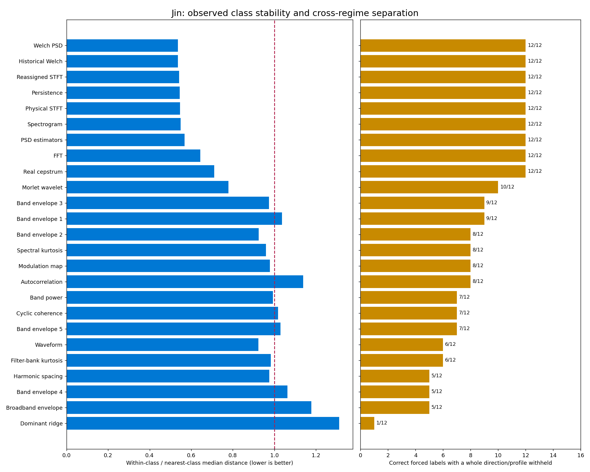
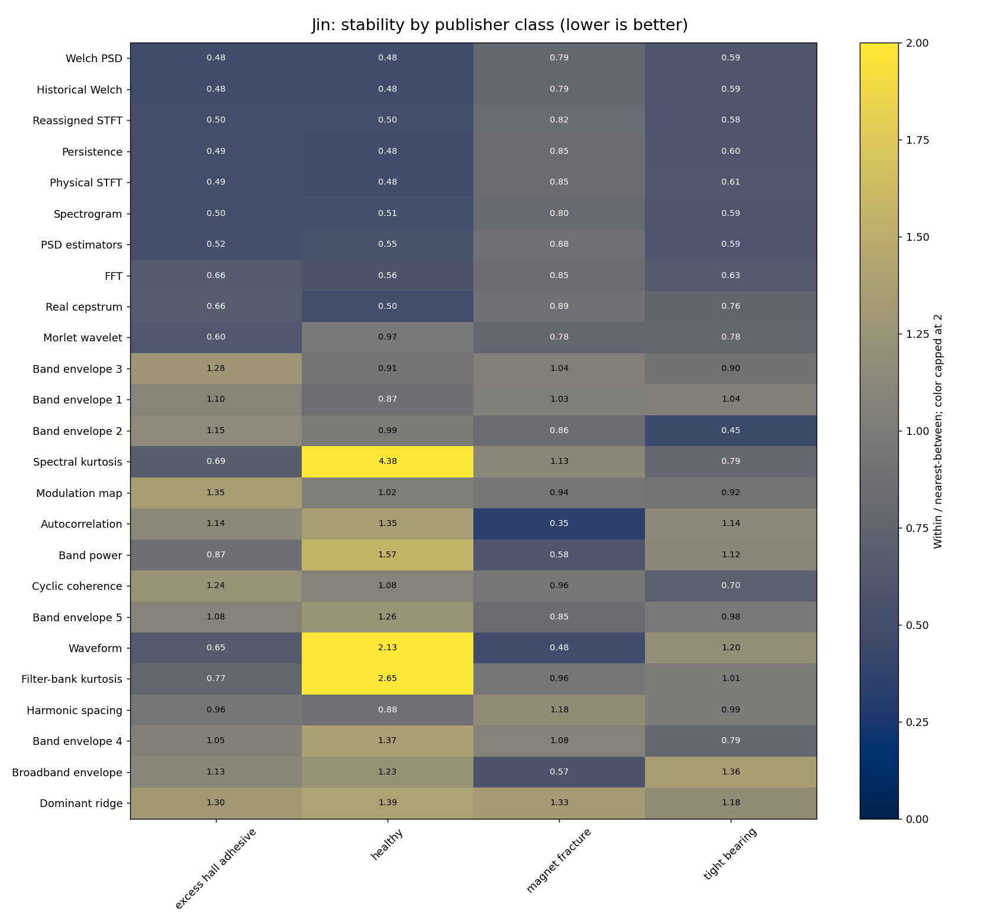
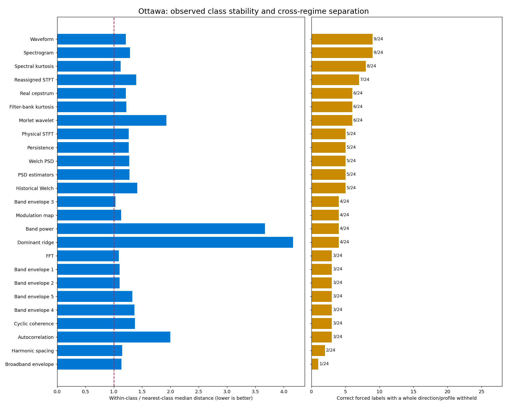
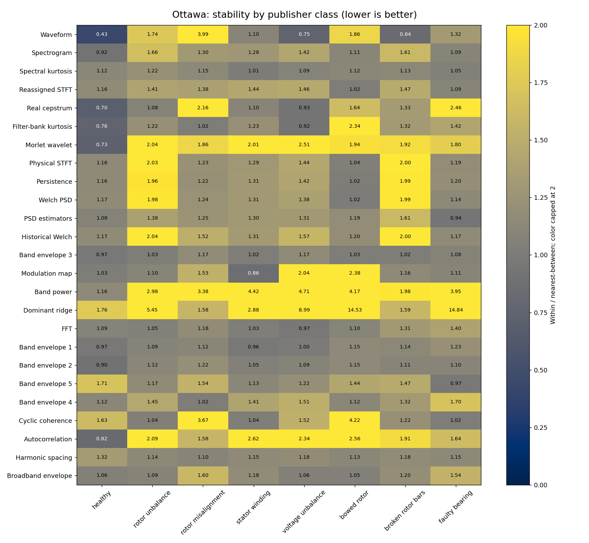

# Full Spectral Shape Separates Jin Families; Ottawa Remains Overlapping

**Retain full spectral shape and cepstrum as candidate family descriptors for Jin. No tested representation gives consistently compact, separated Ottawa families across the observed operating profiles.** Jin Welch, FFT, cepstrum and several related spectral summaries identify 12/12 acquisition groups with a whole direction withheld. Ottawa's best strict profile-held-out result is 9/24, and every tested representation has some within/between-family overlap for every class. These are deterministic, exploratory measurements on previously consumed recordings, not fresh model accuracy or independent-machine validation.

The most important correction to the [model-attribution audit](DSP_DIAGRAM_AUDIT.md) is that often-cited diagrams are not necessarily stable class signatures. In Ottawa, band power and dominant-frequency tracking vary far more within a class than between its closest competing classes. They are useful indicators of changing acoustic regime, but this sample does not support treating them as fixed fault fingerprints. This analysis makes no AI calls and changes no historical decisions or review pages.

## Stability Must Be Measured Against The Closest Competing Family

Here, family means the publisher's labeled condition within one dataset. Each family contributes three acquisition groups: front/left/right in Jin, and profile 1 unloaded/profile 2 unloaded/profile 2 loaded in Ottawa. The analysis includes all 48 recordings in the extended-DSP collection: 24 Jin windows from 12 original directional acquisitions and 24 Ottawa acquisitions. It is not the complete 128-recording Ottawa dataset. Physical machine/session independence is not established.

For every representation and class, W is the median distance between its three acquisition groups. B is the smallest median distance from that class to any other class, including all acquisition combinations. W/B below 1 means within-family changes are typically smaller than differences to the closest other family; W/B near or above 1 indicates overlap or substantial instability. It does not measure absolute physical invariance. Distances retain each representation's units; only the dimensionless ratio is compared across representations.

A stricter observed-gap check asks whether the largest within-family distance is smaller than every distance to another family. A positive gap is complete separation of the observed pairs, not a population guarantee. A class can have W/B below 1 and still fail this check. The nearest competing family and matched-regime between-family distances are retained separately in the JSON results.

The complementary recognition check assigns the nearest acquisition's class after withholding a complete direction in Jin or complete profile in Ottawa. Every class remains represented in training; there is no fitted threshold, rejection option, learned classifier or feature selection inside the check. Correct, wrong and tied/unavailable results remain distinct. Jin's denominator is 12 acquisition groups, not 24 correlated windows. Ottawa's denominator is 24 acquisitions, with eight profile-1 and sixteen profile-2 cases. The less strict profile/load-cell holdout is recorded separately and must not be substituted for the whole-profile result.

## Jin Retains Separation In Full Spectral Representations

The table reports the median class W/B and correct forced labels when an entire direction is withheld. Shared spectral successes are correlated measurements, not independent confirmations.

| Representation | Median W/B | Correct / 12 acquisitions | Classes with complete observed gap / 4 |
| --- | --- | --- | --- |
| Historical Welch control | 0.54 | 12/12 | 3/4 |
| Welch, relative floor | 0.54 | 12/12 | 3/4 |
| Original STFT temporal quantiles | 0.55 | 12/12 | 3/4 |
| Physical STFT temporal quantiles | 0.55 | 12/12 | 3/4 |
| Persistence on actual level axes | 0.55 | 12/12 | 3/4 |
| PSD-estimator curves | 0.57 | 12/12 | 3/4 |
| FFT power shape | 0.64 | 12/12 | 3/4 |
| Cepstrum | 0.71 | 12/12 | 3/4 |
| Wavelet temporal quantiles | 0.78 | 10/12 | 1/4 |
| Relative band power | 0.99 | 7/12 | 0/4 |
| Filter-bank kurtosis | 0.98 | 6/12 | 0/4 |
| Autocorrelation | 1.14 | 8/12 | 0/4 |
| Broadband envelope | 1.18 | 5/12 | 1/4 |
| Dominant-frequency distribution | 1.31 | 1/12 | 0/4 |

Reassigned-STFT quantiles also achieve 12/12 with median W/B 0.54 and three separated classes. By contrast, collapsing spectral content to coarse bands or a dominant line loses much of the observed class structure. The RMS/peak waveform summary reaches only 6/12; it remains an acquisition-quality view rather than a reliable family identifier in this analysis.

| Jin family | Welch W/B | Cepstrum W/B | Coarse-band W/B | Family-specific conclusion |
| --- | --- | --- | --- | --- |
| Excess hall adhesive, C01 | 0.48 | 0.66 | 0.87 | Full spectral shape and cepstrum show complete observed gaps; coarse bands still overlap |
| Healthy, C02 | 0.48 | 0.49 | 1.57 | Stable full-spectrum shape; band allocation and impulsiveness are less stable |
| Magnet fracture, C03 | 0.79 | 0.89 | 0.58 | Closest spectral competitor is tight bearing; no complete Welch/cepstrum gap despite 3/3 directional matches |
| Tight bearing, C04 | 0.59 | 0.76 | 1.12 | Full spectral shape separates the observed groups; coarse bands overlap healthy |

For example, magnet-fracture Welch has median within-family distance 2.68 dB and median distance 3.39 dB to tight bearing. Its maximum within-family change exceeds at least one between-family distance. This is a usable relative ranking in the observed sample, but not a clean universal acceptance radius.

The 500-1,500 Hz carrier-envelope representation is useful for magnet fracture and tight bearing (W/B 0.86 and 0.45; 3/3 directional matches each), but matches only 1/3 acquisitions for adhesive and healthy. Filter-bank kurtosis matches adhesive 3/3 but healthy 0/3; healthy W/B is 2.65. These views have class-specific evidence, not uniform diagnostic value.

Repeated-window stability is insufficient evidence of family stability. Jin Welch distance has a 0.70 dB median over sixteen same-acquisition window pairs, versus 2.85 dB for the median of class-level cross-direction distances. Bands and autocorrelation also change much more between directions than between windows of one recording. Aggregating those windows avoids counting them as independent directional replications.





## Ottawa Features Mostly Follow Regime Or Overlap Across Faults

Every measured Ottawa representation has zero of eight classes with a complete observed gap. Some class-specific relative separation exists, especially for healthy, but none provides a stable distinction among all eight classes.

| Representation | Median W/B | Correct / 24, whole profile withheld | Interpretation |
| --- | --- | --- | --- |
| Original STFT temporal quantiles | 1.29 | 9/24 | Best spectral result in this screen, still overlapping |
| RMS/peak waveform quantiles | 1.21 | 9/24 | Some class/acquisition separation; not a general fault signature |
| Spectral kurtosis | 1.12 | 8/24 | Weak partial signal; only 51% of frequency coordinates are common |
| Reassigned-STFT temporal quantiles | 1.40 | 7/24 | Insufficient separation across profiles |
| Cepstrum | 1.22 | 6/24 | Useful for healthy and voltage unbalance in these three groups each |
| Filter-bank kurtosis | 1.22 | 6/24 | Class-specific partial evidence, no complete gap |
| Welch, relative floor | 1.27 | 5/24 | Within-family spectral change often exceeds nearest-class separation |
| Relative band power | 3.67 | 4/24 | Strong regime sensitivity; healthy contributes 3 of 4 correct matches |
| Dominant-frequency distribution | 4.17 | 4/24 | Particularly unstable as a fault-family fingerprint |
| FFT power shape | 1.09 | 3/24 | No reliable cross-profile class separation under this representation |
| Autocorrelation | 2.00 | 3/24 | All three correct matches are healthy |
| Broadband envelope | 1.13 | 1/24 | No useful general separation demonstrated |

The family detail prevents overinterpreting the aggregate. Healthy has W/B 0.70 with cepstrum, 0.76 with filter-bank kurtosis and 0.82 with autocorrelation, each matching 3/3 acquisitions. Voltage unbalance has cepstrum W/B 0.93 and matches 3/3. Those two classes account for all six cepstrum successes. Bowed rotor matches 3/3 with Welch despite W/B 1.01 and an overlapping distance range. Stator winding matches 3/3 with original-STFT quantiles despite W/B 1.28. A nearest-example match can therefore succeed without a compact, isolated class cluster.

For a concrete unstable pair, dominant-frequency W/B is 14.53 for bowed rotor against faulty bearing and 14.84 in the reverse direction. Their between-family median distance is only 3.15 Hz in this representation, while their within-family median distances are 45.72 and 46.68 Hz. The dominant frequency is changing mostly within the same fault label rather than separating those two labels.

The acquisition design permits a limited factor comparison: profile 1 unloaded versus profile 2 unloaded changes profile; profile 2 unloaded versus loaded changes load. The median across classes of profile-change distance divided by load-change distance is 4.33 for bands, 2.83 for dominant frequency, 2.75 for autocorrelation, 1.54 for Welch and 1.47 for STFT. Profile change exceeds load change in 7/8 classes for bands/ridge and 8/8 for autocorrelation/Welch/STFT. Cepstrum is more balanced at 0.94, but its fault-family overlap remains. These are one observed contrast per factor and class, not causal estimates or independently measured RPM effects.





## The Representation Defines What Was Tested

The analysis compares numerical content, not image pixels or text labels. Full curves preserve physical frequency or lag coordinates. FFT uses pooled linear power on 8,192 bins before a relative 80 dB floor and dB centering; Welch preserves its native grid. PSD-estimator curves are separately centered. Relative band powers use square-root coordinates. Carrier envelopes are already mean-normalized. No reference-label-dependent scaling is fitted.

Raw waveform phase and arbitrary event time are not suitable cross-recording alignment targets here. Waveform features use RMS/peak distributions; dominant-frequency tracks use empirical quantiles; STFT, reassigned STFT and wavelets retain per-frequency 10th/50th/90th temporal quantiles. These summaries test spectral distributions and persistence, not every potentially diagnostic temporal sequence. A poor score does not prove that another representation of the same diagram would fail.

Persistence histograms have record-dependent level axes. Their quantiles are computed on the actual dB axis before centering, rather than comparing row indices. Filter-bank kurtosis, carrier/modulation maps and cyclic coherence retain both physical dimensions. Spectral kurtosis is placed on its exact 10 Hz grid with missing bins preserved. Common finite coordinates are intersected across the dataset without class labels; coverage is reported and less than 20% common support is unavailable. This unsupervised, transductive mask is a limitation of the exploratory holdout check, not a prospective preprocessing guarantee.

Two RPM-dependent views, order spectrum and synchronous average, are unavailable for every recording. They are not assigned zero dispersion or a failure score. The screen has 24 measured diagram representations plus the historical Welch control per dataset, with all 26 original diagram families accounted for. Jin encoding/acquisition confounds and Ottawa motor/class confounds remain; no independent-unit claim follows from the observed separation.

## Keep Stable Structure And Treat Regime Indicators Separately

For Jin, retain a full-spectrum representation and cepstrum as candidate family descriptors; inspect their residual nearest-family overlap before fitting rejection rules. Several successful spectral views are redundant candidates rather than evidence that every panel is needed. Add carrier-envelope or kurtosis evidence only with class-specific validation.

For Ottawa, prioritize matched pruning of dominant-frequency tracking, autocorrelation and band allocation from the classifier input, using their error-associated attribution and poor family stability together. Preserve these views in offline inspection as regime context. Keep the reference bank fixed during pruning, then test multi-regime reference coverage as a separate factor. Remove corresponding numerical evidence as well as panels; otherwise the ablation does not remove the information. Test a combined representation only on a separate acquisition split: choosing class-specific features after inspecting these outcomes would otherwise reuse evaluation information.

The [registration](../examples/results/family-registration.json), [full results](../examples/results/family-separation.json), [Jin details](../examples/results/family-separation.json) and [Ottawa details](../examples/results/family-separation.json) retain physical definitions, available coordinates, group distances, all family comparisons and individual forced predictions. The generator verifies registered audio, dataset, protocol and extension evidence hashes. Features and four rendered figures are bound in the output manifest. No AI inference, threshold fitting, new reference labels or human enrichment was performed.

```powershell
.\.venv\Scripts\python.exe -m scripts.dsp_family_separation --output outputs/dsp-family-separation-new
.\.venv\Scripts\python.exe -m pytest -q tests/test_dsp_extensions.py tests/test_audio_comparison.py
```

Use a new output directory for another run. The numerical summaries and coverage checks are deterministic; the small, previously consumed acquisition set limits statistical and diagnostic conclusions.
